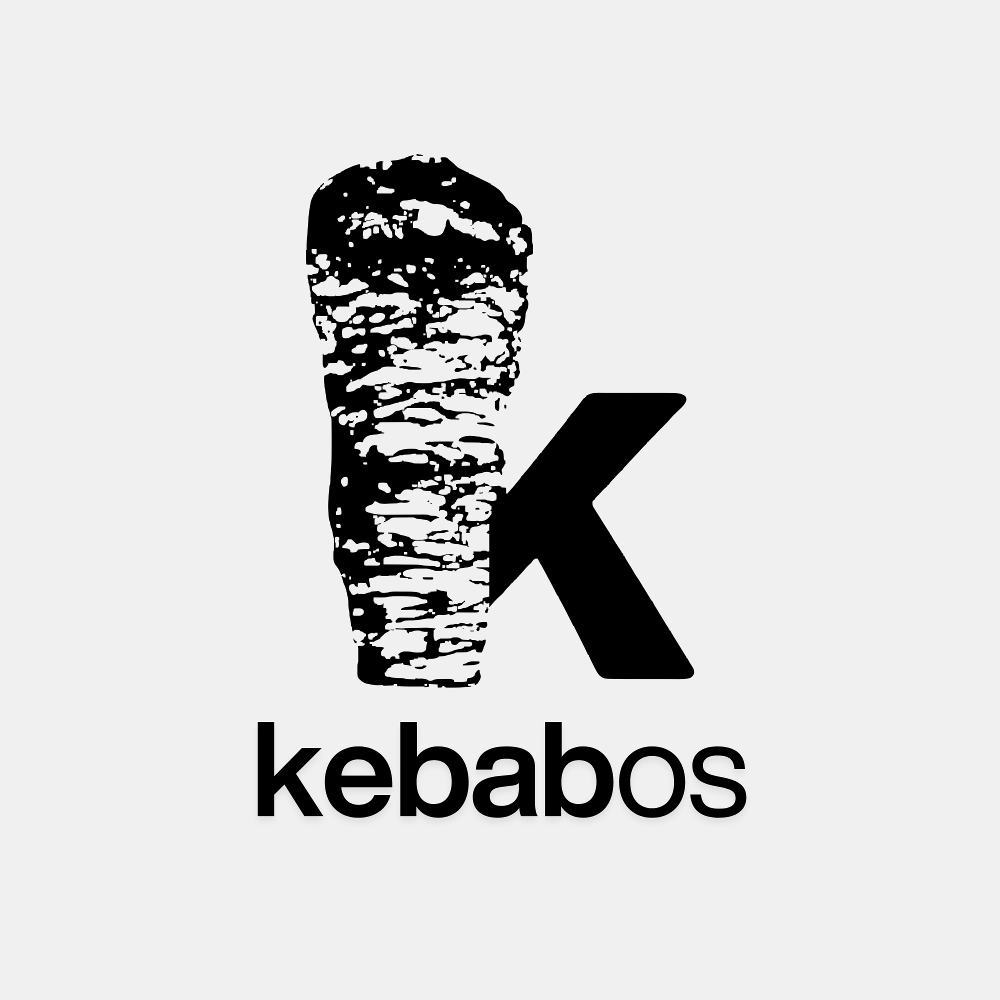

<div align="center">
  <a href="https://kebabos.me"></a>
  <h1>kebab-tools - v1.10.0</h1>
  <div>
    <a href="https://github.com/kebab-os/kebab-tools/issues"></a>
    <a href="#"></a>
    <a href="https://github.com/kebab-os/kebab-tools/releases"></a>
    <a href="#"></a>
    <a href="#"></a>
</a>
  </div><br />
  <b>Command line tools via HTTP</b>
</div>

---

## Introduction

Kebab-tools is a versatile suite of command-line utilities designed for seamless integration into your terminal workflow via curl. Built for developers who value efficiency and minimalism, it eliminates the need to switch between windows or leave the CLI to perform common tasks. Whether you're debugging, formatting data, or managing system operations, kebab-tools provides a fast, dependency-free way to access essential developer resources directly from your shell.


## Get started

### Curl (easiest setup)

1. Start by running this bash command in shell:

```bash
curl https://tools.kebabos.me
```

If that doesnt work, try our secondary domain:

```bash
curl https://kebab-tools.pages.dev
```

2. To view help, use the `/help` endpoint, or use `help/[page #]` to view certain sections. Use the `/list` endpoint to view a json list of all the tools.

If this doesnt work, [raise an issue](https://github.com/kebab-os/kebab-tools/issues/new/choose) to help support the project.

### Client Shell (advanced setup)

Instead of using bash commands like curl to use kebab-tools, use the client shell to easily run endpoints. To get started, download [this file](cs/kebab-tools.py). To run the client shell, enter the same directory as the file, then run:

```bash
python kebab-tools.py
```

Following these steps should launch the client shell.

> [!TIP]
> To quickly install client shell in a useful location, run this install script:
> ```bash
> cd ~
> mkdir kt
> cd kt
> curl -O https://raw.githubusercontent.com/kebab-os/kebab-tools/refs/heads/main/cs/kebab-tools.py
> ```
>
> Then whenever you want to access it, run `python ~/kt/kebab-tools.py`.


## Web Shell

If you prefer to use kebab-tools directly through your browser, you can access the web-based version by visiting [tools.kebabos.me](https://tools.kebabos.me) on a browser. Once the page loads, you will find an intuitive GUI that allows you to manage and interact with all available tools without needing to use a command line.


## Key Files/Directories

|File/Directory|Description|
|-|-|
|`cs/kebab-tools.py`|Client shell|
|`functions`|All tools|
|`install/client-shell-install.sh`|Client shell install|
|`package.json`|Package|
|`functions/shell-proxy`|Node for webshell|


## Dependencies

Install all the [dependencies](dependencies.txt) in order to use kebab-tools.


## Issues

To help improve kebab-tools, contributing to this repository would be appriciated. To help us fix bugs, [create an issue](https://github.com/kebab-os/kebab-tools/issues/new/choose) to make kebab-tools free of any bugs.


## Contributing

Pull requests are welcome. For major changes, please open an issue first
to discuss what you would like to change.

Please make sure to update tests as appropriate.

### Contributors

As of `20/03/2026`, these are the contributors for kebab-tools:

- [@7aimez](https://github.com/7aimez) - 7ames
- [@ethembeldagli](https://github.com/ethembeldagli) - Ethem Beldagli


## License

<a href="LICENSE"></a>
